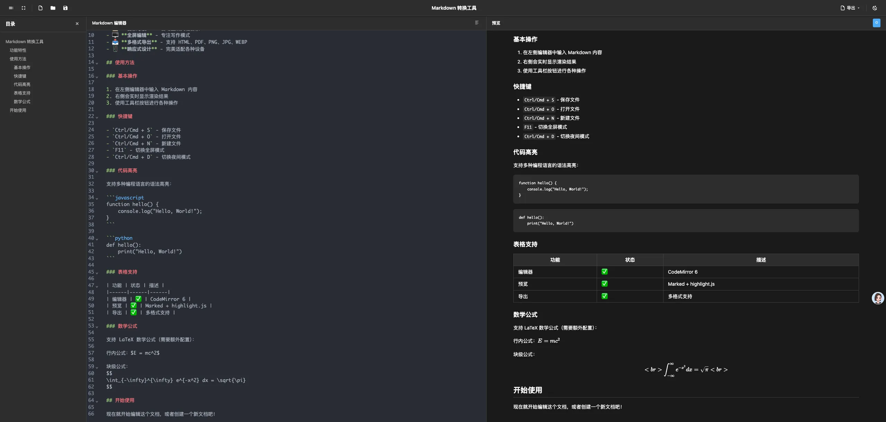

# Markdown 转换工具

一个基于 Cloudflare Pages 运行的强大 Markdown 编辑器和转换工具，支持实时预览和多格式导出。



## ✨ 功能特性

- 🖊️ **实时编辑预览** - 左侧编辑，右侧实时预览，支持滚动同步
- 🌙 **夜间模式** - 支持明暗主题切换，自动适应系统主题
- 📋 **目录导航** - 自动生成文档目录，快速跳转
- 🖥️ **全屏编辑** - 专注写作模式，隐藏预览面板
- 📤 **多格式导出** - 支持导出 HTML、PDF、PNG、JPG、WEBP
- 📱 **响应式设计** - 完美适配桌面和移动设备
- ⚡ **高性能** - 基于 CodeMirror 6 和 Vite 构建
- 🎨 **语法高亮** - 支持多种编程语言语法高亮
- 💾 **文件操作** - 支持新建、打开、保存 Markdown 文件

## 🚀 快速开始

### 本地开发

1. 克隆项目
```bash
git clone <repository-url>
cd md2img
```

2. 安装依赖
```bash
pnpm install
```

3. 启动开发服务器
```bash
pnpm run dev
```

4. 打开浏览器访问 `http://localhost:3000`

### 构建生产版本

```bash
pnpm run build
```

构建产物将生成在 `dist` 目录中。

## 🌐 部署到 Cloudflare Pages

### 方法一：通过 Git 集成（推荐）

1. 将代码推送到 GitHub/GitLab
2. 登录 [Cloudflare Dashboard](https://dash.cloudflare.com/)
3. 进入 Pages 页面，点击 "Create a project"
4. 连接你的 Git 仓库
5. 配置构建设置：
   - **构建命令**: `pnpm run build`
   - **构建输出目录**: `dist`
   - **Node.js 版本**: `18` 或更高

### 方法二：通过 Wrangler CLI

1. 安装 Wrangler CLI
```bash
npm install -g wrangler
```

2. 登录 Cloudflare
```bash
wrangler login
```

3. 构建并部署
```bash
pnpm run deploy
```

## 📖 使用指南

### 基本操作

1. **编辑文档** - 在左侧编辑器中输入 Markdown 内容
2. **实时预览** - 右侧会实时显示渲染结果
3. **切换主题** - 点击工具栏中的主题按钮
4. **全屏编辑** - 点击全屏按钮专注写作
5. **查看目录** - 点击目录按钮显示文档大纲

### 快捷键

- `Ctrl/Cmd + S` - 保存文件
- `Ctrl/Cmd + O` - 打开文件
- `Ctrl/Cmd + N` - 新建文件
- `F11` - 切换全屏模式
- `Ctrl/Cmd + D` - 切换夜间模式

### 导出功能

支持导出多种格式：

- **HTML** - 完整的 HTML 文档，包含样式
- **PDF** - 高质量 PDF 文档
- **PNG** - 高清图片格式
- **JPG** - 压缩图片格式
- **WEBP** - 现代图片格式，体积更小

## 🛠️ 技术栈

- **前端框架**: Vanilla JavaScript + Vite
- **编辑器**: CodeMirror 6
- **Markdown 解析**: Marked
- **语法高亮**: Highlight.js
- **PDF 生成**: jsPDF
- **图片生成**: html2canvas
- **安全处理**: DOMPurify
- **部署平台**: Cloudflare Pages

## 📁 项目结构

```
md2img/
├── index.html          # 主 HTML 文件
├── style.css           # 样式文件
├── main.js             # 主 JavaScript 文件
├── package.json        # 项目配置
├── vite.config.js      # Vite 配置
├── wrangler.toml       # Cloudflare 配置
└── README.md           # 项目说明
```

## 🌟 Star History

[](https://www.star-history.com/#markdown-to-image&Date)

## 🤝 贡献

欢迎提交 Issue 和 Pull Request！

## 📄 许可证

MIT License

## 🔗 相关链接

- [CodeMirror 6](https://codemirror.net/)
- [Marked](https://marked.js.org/)
- [Cloudflare Pages](https://pages.cloudflare.com/)
- [Vite](https://vitejs.dev/)