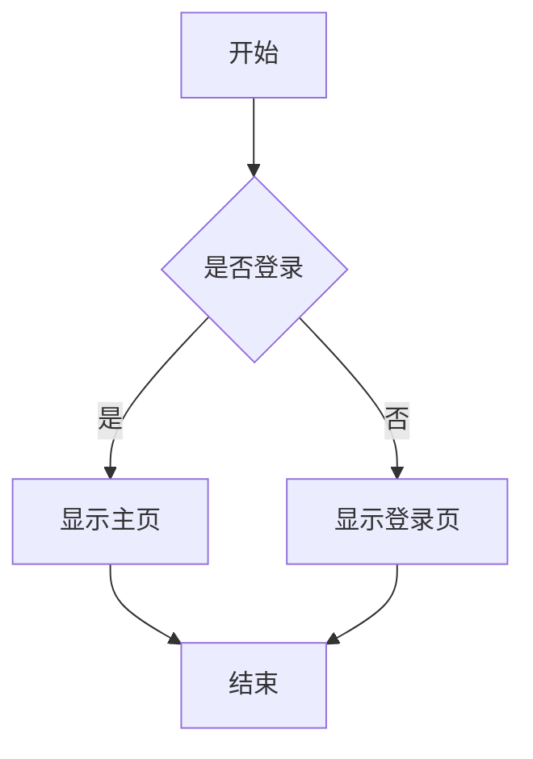

# Markdown 预览编辑转换工具！

欢迎使用这个功能强大的 Markdown 编辑器！

## 功能特性

- ✨ **实时预览** - 左侧编辑，右侧实时预览
- 🌙 **夜间模式** - 支持明暗主题切换
- 📋 **目录导航** - 自动生成文档目录
- 🖥️ **全屏编辑** - 专注写作模式
- 📤 **多格式导出** - 支持 HTML、PDF、PNG、JPG、WEBP
- 📱 **响应式设计** - 完美适配各种设备

## 使用方法

### 基本操作

1. 在左侧编辑器中输入 Markdown 内容
2. 右侧会实时显示渲染结果
3. 使用工具栏按钮进行各种操作

### 快捷键

- `Ctrl/Cmd + S` - 保存文件
- `Ctrl/Cmd + O` - 打开文件
- `Ctrl/Cmd + N` - 新建文件
- `F11` - 切换全屏模式
- `Ctrl/Cmd + D` - 切换夜间模式

### 代码高亮

支持多种编程语言的语法高亮：

```javascript
function hello() {
    console.log("Hello, World!");
}
```

### 数学公式

支持 LaTeX 数学公式渲染：

行内公式：$E = mc^2$

块级公式：
$$
\int_{-\infty}^{\infty} e^{-x^2} dx = \sqrt{\pi}
$$

### 图表支持

支持 Mermaid 图表：



开始创作你的 Markdown 文档吧！🚀